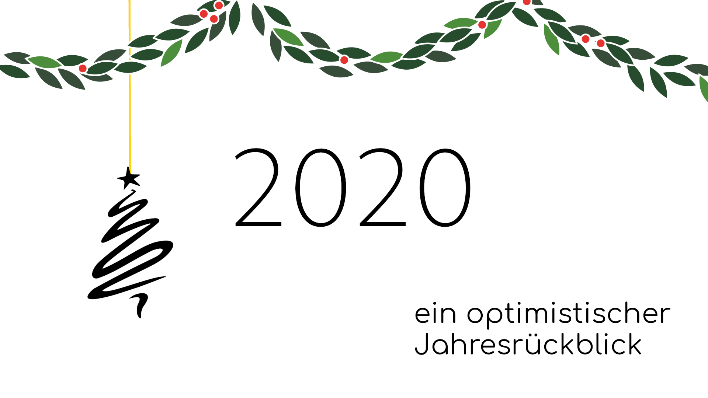

# OptimisMuss 2020

Ein optimistischer Jahresrückblick von Malte Dostal

## Vorwort [Überspringen](#januar)

Der vorliegende Jahresrückblick ist gemäß seines Titels durch die Gläser einer rosaroten Brille
recherchiert und geschrieben. Dahingehend werden hier nur positive Ereignisse des
Kalenderjahres 2020 aufgeführt.
Unter keinen Umständen ist die Intention dahinter, die anhaltende Situation schönzureden
oder die Betroffenen zu diskreditieren, viel mehr sollen die herausragendsten Errungenschaften
des Jahres reminisziert und gefeiert werden.

Die Aggregation der folgenden Ereignisse, Nachrichten und Errungenschaften wurde durch die
Wikipedia-Artikel der einzelnen Monate, sowie archivierten Versionen des Forums
[r/UpliftingNews](https://www.reddit.com/r/UpliftingNews) im Rahmen der
[WayBackMachine](https://archive.org/web/) maßgeblich erleichtert.
Beide Non-Profit-Organisationen (Wikimedia und das Internet Archive) sammeln derzeit wie
jedes Jahr Spenden; es sei hiermit zwanglos empfohlen, einen kleinen Beitrag zu weltweitem,
freien Wissen und dem Erhalt von Internetkultur und -wissen beizusteuern.
 

## Januar

Das Jahr fängt hierzulande mit einem zwar kleinen aber dennoch nicht zu übersehenden Schritt
in die richtige Richtung an: in Augsburg sind jetzt öffentliche Verkehrsmittel in der Innenstadt
("City-Zone") vollkommen kostenfrei. So wird es attraktiver, mit den ÖPNV durch die Stadt
zu fahren, als mit dem eignen Auto, was bekanntermaßen niedrigere Emissionen von
Treibhausgasen und anderen für Mensch und Umwelt schädliche Stoffe zur Folge hat.
Jetzt kostet das nicht nur nichts mehr, eventuelle Wartezeiten an Ticketautomaten oder -schaltern
gibt es jetzt ebenfalls nicht mehr zu befürchten.\
Quellen und zusätzliche Informationen:
[Gratis durch die City-Zone - swa](https://www.sw-augsburg.de/magazin/detail/gratis-durch-die-city-zone/)

Ein Schritt mit selber Intention erfolgt zum Neujahr auch von der Bundesregierung:
der Fernverkehr der Deutschen Bahn ist ab Sofort mit 7% statt den bisherigen 19% besteuert.
Wegen der vollständigen Weitergabe an die Kunden zahlen Fernverkehrfahrer der
Deutschen Bahn jetzt circa 10% weniger, was auch hier die Entscheidung,
nicht mit dem Auto zu fahren, erleichtert.\
Quellen und zusätzliche Informationen:
[Nicht alle Bahn-Tickets sind billiger geworden - BR24](https://www.br.de/nachrichten/deutschland-welt/nicht-alle-bahn-tickets-sind-billiger-geworden,Rmcg1SM)

Ab dem **13.01** gilt die Ehe-Für-Alle im gesamten Vereinigten Königreich: in Nordirland,
als letzter großer Teil der Vereinigung, wird die Eheschließung gleichgeschlechtlicher Paare
legalisiert. In den allermeisten westeuropäischen Ländern sind homosexuelle (und bisexuelle)
Menschen jetzt in dieser Hinsicht gleichgestellt und nicht länger benachteiligt. Auch in anderen
europäischen Ländern, in denen nur Eingetragene Partnerschaften möglich sind - zum Beispiel
in der Schweiz - wird der Druck der Bevölkerung immer größer.\
Quellen und zusätzliche Informationen:
[Same-sex marriage now legal in Northern Ireland - bbc](https://www.bbc.com/news/uk-northern-ireland-51086276)
- [Gleichgeschlechtliche Ehe – Situation in Europa - Wikipedia ](https://de.wikipedia.org/wiki/Gleichgeschlechtliche_Ehe#Europa)
 

**21.01**: Nach Monaten des politischen Stillstandes und anhaltender Demonstrationen
gibt es in Libanon eine neue Regierung: Premierminister Hassan Diab formt ein neues Kabinett -
gemäß der Forderungen der Demonstranten ohne Minister aus traditionellen Parteien.
Außerdem gibt es jetzt mehr Frauen in der Regierung, zum Beispiel
Verteidigungsministerin Zeina Akar.\
Quellen und zusätzliche Informationen: [Libanon hat eine neue Regierung - DW](https://www.dw.com/de/libanon-hat-eine-neue-regierung/a-52102715)
 

## Februar

Am **09.02** finden die Oscar-Verleihungen statt; "Parasite" des südkoreanischen Regisseurs
Bong Joon-ho gewinnt als erste internationale Produktion in der Kategorie "Bester Film des Jahres".
Die Mitwirkenden bekommen als Folge viel Aufmerksamkeit, außerdem
ist es ein Zeichen dafür, dass nicht nur die teuersten Hollywood-Produktionen aus den
Vereinigten Staaten erfolgreiche und schöne Filme sein können.\
Quellen und zusätzliche Informationen: [Parasite (Film) - Wikipedia](https://de.wikipedia.org/wiki/Parasite_(Film))

Die Europäische Weltraumagentur (ESA) startet am **10.02** die Sonde "Solar Orbiter" zur
Sonne, die als bisher komplexeste ihrer Art zum Beispiel den 11-Jährigen Zyklus der Sonnenwinde
erforschen soll. Besonders wichtig ist das, weil starke solare Winde auf der Erde beispielsweise
Kurzwellenkommunikation stören können. Die ersten Fotos der
Sonde werden im Juli 2020 veröffentlicht werden.\
Quellen und zusätzliche Informationen:
[Solar Orbiter - ESA](https://www.esa.int/Science_Exploration/Space_Science/Solar_Orbiter)
- [Sonnenwind - Wikipedia](https://de.wikipedia.org/wiki/Sonnenwind#Auswirkungen)
 

Was Deutschland im Januar im Kleinen angefangen hat, wird von unseren Nachbarn im großen
Stil implementiert: In ganz Luxemburg sind ab dem **29.02** alle öffentlichen Verkehrsmittel, die vom Staat betrieben
werden vollkommen kostenfrei zu benutzen. Lediglich die 1. Klasse in Zügen und kommunal betriebene ÖPNV
sind noch kostenpflichtig. Dieser Maßgebliche Beitrag zum Klimaschutz ist eine weltweite Neuheit und
kostet den Staat 41 Millionen Euro.
Luxemburg sieht sich dahingehend für die anderen europäischen Länder
(auch Nachbar- Deutschland) als Vorbild und würde das System gerne nachgeahmt sehen.
Weil Deutschland so viel größer ist, würde eine vollständige Einführung des Systems
allerdings jährliche Kosten von circa 13 Milliarden Euro mit sich ziehen - bisher zu viel für die
Regierung, aber das Thema ist hierzulande noch lange nicht vom Tisch.\
Quellen und zusätzliche Informationen:
[Luxemburg: Kostenloser ÖPNV ist erst der Anfang - tagesschau.de](https://www.tagesschau.de/ausland/luxemburg-kostenloser-nahverkehr-101.html)
 

## März

Im März geht es gleich weiter mit europäischen Maßnahmen, um das Klima zu schützen: in den
Niederlanden gilt jetzt tagsüber ein Tempolimit von 100 km/h auf allen Autobahnen im Land.
Das Ziel der Regelung ist es, die Stickoxidemissionen zu reduzieren.\
Quellen und zusätzliche Informationen:
[Tempo 100 in Holland - ADAC](https://www.adac.de/verkehr/tempo-100-holland/)
- [Umweltbundesamt: Tempolimits gut fürs Klima - tagesschau.de](https://www.tagesschau.de/inland/tempolimit-umweltamtbundes-studie-101.html)
 

Am **10.03** wird Adam Castillejo durch eine Stammzellentransplantation von HIV geheilt.
Er ist damit nach Timothy Brown, der mit einer ähnlichen Behandlung 2011 von dem Virus
geheilt wurde, der zweite Mensch aller Zeiten, der erfolgreich von HIV geheilt werden konnte.\
Quellen und zusätzliche Informationen:
[Second person ever to be cleared of HIV - The Guardian](https://www.theguardian.com/science/2020/mar/09/second-person-cleared-hiv-adam-castillejo-reveals-identity)
 

## April

Im April macht die NASA große Fortschritte bei ihrem "Artemis" Programm, welches das Ziel hat,
wieder Menschen auf den Mond zu fliegen und dort entsprechende Infrastruktur aufzubauen.
Dahingehend werden die Firmen SpaceX von Elon Musk und Blue Origin von Jeff Bezos damit
beauftragt, Mondlandegeräte zu konstruieren. Langfristig wird die NASA mit diesem Programm
dazu beitragen, den Menschen multiplanetär zu machen.\
Quellen und zusätzliche Informationen:
[SpaceX, Blue Origin land contracts to build NASA's astronaut moon lander - Reuters](https://uk.reuters.com/article/us-space-exploration-nasa/musks-spacex-bezos-blue-origin-land-contracts-to-build-nasas-astronaut-moon-lander-idUKKBN22C3DI)
- [Artemis - NASA](https://www.nasa.gov/specials/artemis/)
 

Der April hält sich in Sachen Umweltschutz auch nicht lange zurück: in Pakistan ist die
Honigproduktion dank des Staatsprojektes "Billion Tree Tsunami" um 70% gestiegen.
Das Projekt wurde 2014 gestartet und hat seitdem die versprochene Milliarde an
Bäumen gepflanzt. Aber Pakistan ist noch lange nicht fertig: 2018 hat der Premierminister
das Projekt "10 Billion Tree Tsunami" gestartet, welches, genau wie der Name verspricht,
zehn Milliarden gepflanzte Bäume als Ziel hat.\
Quellen und zusätzliche Informationen: [Pakistan's Honey Production Increases by 70% - propakistani](https://web.archive.org/web/20200422145651/https://propakistani.pk/2020/04/20/pakistans-honey-production-increases-by-70-thanks-to-billion-tree-project/)
- [Billion Tree Tsunami - Wikipedia](https://en.wikipedia.org/wiki/Billion_Tree_Tsunami)
- [See How The "10 Billion Tree Tsunami"  Campaign Transformed This Area - Bored Panda](https://www.boredpanda.com/ten-billion-tree-tsunami-project-progress/?utm_source=google&utm_medium=organic&utm_campaign=organic)
 

## Mai

Mit Umweltschutz und Bäumen geht es im Mai direkt weiter; die Aktion "TeamTrees" der beiden
amerikanischen YouTuber "Mister Beast" und "Mark Rober" erreicht 22 Millionen US-Dollar an
Spendengeldern. Die Aktion wurde 2019 gestartet und pflanzt mit der "Arbor Day Foundation"
für jeden gesammelten Dollar einen Baum. Die bis spätestens Ende 2022 gesetzten Bäume
werden schätzungsweise 1,6 Millionen Tonnen CO2 aus der Luft filtern.\
Quellen und zusätzliche Informationen: [Team Trees - Wikipedia](https://de.wikipedia.org/wiki/Team_Trees)
- [teamtrees.org](https://teamtrees.org)
 

Am **30.05** gelingt SpaceX ein großer Durchbruch: mit Robert Behnken und Douglas Hurley
schießt die Firma unter Elon Musk die ersten Amerikaner seit 2011 in das All, nämlich zur
Internationalen Raumstation ISS. Ein großer Schritt der ehemaligen Pionier-Nation in Sachen
Raumfahrt und sicherlich eine Vorbereitung auf "Artemis", welches bereits im Monat zuvor
große Fortschritte machen konnte (siehe oben).\
Quellen und zusätzliche Informationen: [DM-2 - NASA](https://www.nasa.gov/specials/dm2/)
 

## Juni

Der Umweltschutz ist omnipräsent: Äthiopien beschließt, dieses Jahr fünf Milliarden Bäume zu
pflanzen, als Teil des viel größeren Planes, bis 2024 ganze 20 Milliarden Bäume zu pflanzen.\
Quellen und zusätzliche Informationen:
[Ethiopia to plant 5 billion trees in 2020 - qz.com](https://web.archive.org/web/20200610192642/https://qz.com/africa/1866532/ethiopia-to-plant-5-billion-trees-in-2020-to-beat-climate-change/)

Ebenfalls im Juni zeigen Umfragen erfreuliche Zahlen: in den Vereinigten Staaten ist der
Bevölkerung Zuspruch der Ehe-Für-Alle bei einem Rekordhoch: 67% der Amerikaner befürworten
die bestehende Legalität der Eheschließung zwischen gleichgeschlechtlichen Partnern.
Während der US-Bundesstaat Massachusetts 2004 als eine der ersten Regierungen auf der
Welt die Heirat von homosexuellen Paaren legalisiert hat, so hat es doch bis 2017 gedauert,
bis alle 50 Bundesstaaten ebenfalls das Recht auf Eheschließung von allen Paaren erlaubt hat.
Dass 2020 zwei Drittel der US-Amerikanischen Bevölkerung der Gesetzeslage zustimmt zeigt,
dass es genau die richtigen Entscheidungen waren, die schlussendlich
alle Bundesstaaten der USA getroffen haben.\
Quellen und zusätzliche Informationen:
[U.S. Support for Same-Sex Marriage Matches Record High](https://news.gallup.com/poll/311672/support-sex-marriage-matches-record-high.aspx)
- [Same-sex marriage in the United States - Wikipedia](https://en.wikipedia.org/wiki/Same-sex_marriage_in_the_United_States)
 

## Juli

**06.07**: Australiens größte Stadt, Sydney, stellt ihren Stromverbrauch vollständig auf erneuerbare
Energiequellen um. Das bedeutet, dass in der ganzen Stadt die Straßenlaternen,
Schwimmbäder, Regierungsgebäude und das Rathaus von jetzt an mit Strom von einer Windfarm
und zwei Solarparks betrieben werden.\
Quellen und zusätzliche Informationen:
[The City of Sydney is now on 100% renewable energy - EGEB](https://electrek.co/2020/07/06/egeb-the-city-of-sydney-100-renewable-energy-arc-marine-reef-cubes-offshore-wind/)

Am **19.07** gibt es wieder gute Nachrichten aus dem All - die Raumsonde "al-Amal"
("Die Hoffnung"; international auch oft "Hope" genannt) der Vereinigten Arabischen Emirate startet
von Japan aus zum Planet Mars. Es machen also dieses Jahr nicht nur die NASA und ESA
fortschritte, sondern auch andere Länder und deren Raumfahrtprogramme. Der Name soll
laut Muhammad bin Raschid Al Maktum, dem Emirat von Dubai, eine Botschaft des Optimismus
and Millionen junge Araber aussenden. Die Erkenntnisse der Sonde werden der internationalen
Fachöffentlichkeit frei zur Verfügung gestellt werden.\
Quellen und zusätzliche Informationen: [al-Amal - Wikipedia](https://de.wikipedia.org/wiki/Al-Amal)

Gleich beim Thema Raumfahrt zum Mars zu bleibend startet am **20.07** die Mars-2020
Mission der Vereinigten Staaten von Amerika. Damit schickt die NASA ihren fünften Mars-Rover
und ihren ersten Mars-Helikopter auf unseren Nachbarplaneten. Die Ankunft der Mission ist für
den 18.02.2021 angesetzt und die beiden Vehikel sollen unter anderem dabei helfen, Erkenntnisse
über mögliches Leben auf dem Mars zu erlangen.\
Quellen und zusätzliche Informationen: [Mars-2020 - Wikipedia](https://de.wikipedia.org/wiki/Mars_2020)
 

## August

**10.08**: ein Wissenschaftlerteam aus Australien und China habe einen Weg gefunden, mit Hilfe
von Solarenergie effizient Wasser zu filtern: mit der von ihnen entwickelten Technik ist es möglich,
bis zu 150 Liter verunreinigtes Wasser in 30 Minuten sauberer zu filtern, als die WHO empfiehlt.\
Quellen und zusätzliche Informationen:
[Sunlight could solve drinking water's biggest problem in 30 minutes - inverse.com](https://www.inverse.com/innovation/sunlight-powered-clean-water)

Am **25.08** gibt es wunderbare Nachrichten aus Afrika: der ganze Kontinent hat Polio besiegt
und ist jetzt frei von der Krankheit. Auch "Kinderlähmung" genannt befiel die von Polioviren
induzierte Krankheit besonders sehr junge Menschen und konnte in schlimmen Fällen bleibende
Lähmungen verursachen. Wie auch in Deutschland war eine Konsequente Immunisierung durch
Impfungen der Schlüssel zum Erfolg.\
Quellen und zusätzliche Informationen:
[Africa declared free of wild polio in 'milestone' - bbc](https://www.bbc.com/news/world-africa-53887947)

## September

**07.09**: Der ungarische Forscher Botond Roska gewinnt als Anerkennung für seine Behandlung
zur Heilung von Blinden den deutschen Körber-Preis. Teil des Gewinns ist auch ein Preisgeld
in Höhe von einer Million Euro. Seine genbasierte Behandlungsmethode wird bereits klinisch
getestet.\
Quellen und zusätzliche Informationen:
[Hungary's researcher Roska wins award for procedure that could cure blindness - dw.com](https://www.dw.com/en/hungarys-researcher-roska-wins-award-for-procedure-that-could-cure-blindness/a-54846376)

(14.09) Das Jahr neigt sich dem Ende zu, die positiven Nachrichten in Sachen Umwelt und Klimaschutz
lassen aber nicht nach: in vielen Bundesstaaten der USA ist die Bienenpopulation rapide gewachsen:
In Maine, Oklahoma, Nebraska und Michigan ist die Anzahl an Bienen jeweils über 50% gestiegen.
Quellen und zusätzliche Informationen:
[Michigan bee populations are on the rise according to new data - metrotimes.com](https://www.metrotimes.com/table-and-bar/archives/2020/09/14/bee-lieve-it-or-not-michigan-bee-populations-are-on-the-rise-according-to-new-data)
- [Why are bees important? And how you can help them - woodlandtrust.org](https://www.woodlandtrust.org.uk/blog/2018/07/why-are-bees-important-and-how-you-can-help-them)
 

Am **17.09** spricht Papst Franziskus zu einer kleinen Gruppe italienischer Eltern von Kindern,
die sich als LGBT identifizieren. Zitat des Papstes: "Gott liebt eure Kinder so wie sie sind".
Kinder und Jugendliche, die in dieser Hinsicht nicht der gesellschaftlichen (und vor allem christlichen)
Norm entsprechen, haben es oft in gläubigen Familien besonders schwer, weil zum Beispiel
konservative Christen dahingehen oft an der Bibel festhalten. Der Papst macht damit ein klares
und starkes Statement, dass man die Bibel vielleicht zumindest bei solchen Themen mit dem Kontext
ihrer Zeit im Hinterkopf verstehen sollte.\
Quellen und zusätzliche Informationen:
[Pope Francis to parents of L.G.B.T. children: ‘God loves your children as they are.’ - americamagazine.org](https://www.americamagazine.org/faith/2020/09/17/pope-francis-parents-lgbt-children-god-loves-your-children-they-are)

## Oktober

**07.10** In Griechenland wird gefeiert: Die neofaschistische, neonazistische Partei "Chrysi Avgi"
("Goldene Morgenröte") wurde als illegale Vereinigung eingestuft, die sieben führenden Mitglieder
zu einer Gefängnisstrafe von 13 Jahren verurteilt und die Partei nach sieben Jahren von 2012 bis 2019
aus dem griechischen Parlament geworfen.\
Quellen und zusätzliche Informationen:
[Golden Dawn guilty verdicts celebrated across Greece - theguardian](https://www.theguardian.com/world/2020/oct/07/golden-dawn-leader-and-ex-mps-found-guilty-in-landmark-trial)
- [Chrysi Avgi - Wikipedia](https://de.wikipedia.org/wiki/Chrysi_Avgi)
- [Nikolaos Michaloliakos - Wikipedia](https://de.wikipedia.org/wiki/Nikolaos_Michaloliakos)
 

Am **09.10** wird der Friedensnobelpreis 2020 verliehen: das Welternährungsprogramm der Vereinten Nationen
wird geehrt für
> "[...] its efforts to combat hunger, for its contribution to bettering conditions for
> peace in conflict-affected areas and for acting as a driving force in efforts to prevent the use of
> hunger as a weapon of war and conflict." (Verweis in den Quellen)

Frei übersetzt bekommt
die Organisation den Preis für
> "[...] ihre Anstrengungen den Hunger zu bekämpfen, für ihren
> Beitrag zur Verbesserung der Bedingungen für Frieden in Konfliktzonen und dafür, dass sie als
> treibende Kraft hinter den Anstrengungen stehe zu verhindern, dass Hunger als eine Waffe
> im Krieg und in Konflikte benutzt wird"

Quellen und zusätzliche Informationen:
[The Nobel Peace Prize 2020 - nobelprize.org](https://www.nobelprize.org/prizes/peace/2020/summary/)
- [Nobelpreisrede: WFP-Exekutivdirektor fordert Welt auf, Reichtum gegen Hungersnöte zu verwenden - wfp.org](https://de.wfp.org/)
 

## November

Ab dem **03.11** finden die Präsidentschaftswahlen in den USA statt und die Wahlbeteiligung
ist (zumindest in absoluten Zahlen) so hoch wie noch nie. Fast 160 Millionen Amerikaner haben
ein Kreuz gemacht, was circa 49% der Bevölkerung entspricht und damit 7% Prozent höher
ist als bei der Clinton-Trump Wahl 2016. Der Trend, dass die Wahlbeteiligung wieder steigt,
lässt sich auch in anderen Wahlsystemen beobachten, zum Beispiel in Deutschland und bei den
Europawahlen.\
Quellen und zusätzliche Informationen:
[The 2020 Election Set a Record for Voter Turnout - time.com](https://time.com/5907062/record-turnout-history/)
- [Wahlbeteiligung - Wikipedia](https://de.wikipedia.org/wiki/Wahlbeteiligung#Andere_L%C3%A4nder)
 

**10.11** Der amerikanische Technologie-Gigant Apple stellt den ersten hauseigenen
Computerprozessor vor und treibt die Industrie damit in zweierlei Hinsicht weit voran: erstens hat Intel
damit einen großen Kunden verloren und muss daher, um im Wettbewerb zu bleiben, innovative Technologien
entwickeln und zweitens hat Apple damit den ersten kommerziellen 5-Nanometer Chip für
Computer herausgebracht, was einen bedeutenden Meilenstein darstellt.\
Quellen und zusätzliche Informationen:
[Apple stellt den M1 vor - apple.com](https://www.apple.com/de/newsroom/2020/11/apple-unleashes-m1/)
- [5 nm process](https://en.wikipedia.org/wiki/5_nm_process)
 

Am **29.11** speist der größte deutsche Solarpark seine erste Kilowattstunde in das Stromnetz.
Die Anlage in Werneuchen (Brandenburg), bestehend aus 465000 Modulen kann genug Strom
produzieren, um ungefähr 50000 Haushalte zu versorgen. Der Park ist ein Projekt der EnBW und
wird komplett ohne staatliche Zuschüsse finanziert.\
Quellen und zusätzliche Informationen:
[Germany’s largest solar park feeds first kilowatt hour of electricity into the grid - NS Energy](https://www.nsenergybusiness.com/news/germanys-largest-solar-park-feeds-first-kilowatt-hour-of-electricity-into-the-grid/)

## Dezember (stand 16.12)

Der jährliche Klimabericht der EU spricht eine optimistische Sprache: Die Treibhausgasemissionen
der Europäischen Union sind seit 1990 um 24% gesunken. Im Vergleich zu 2019 war der Ausstoß
sogar ungefähr 8% geringer, doch die EU will sich auf diesem Erfolg nicht ausruhen: Sprecher
der Union haben nochmal das Ziel, bis 2050 der erste Klimaneutrale Kontinent zu werden, verdeutlicht.\
Quellen und zusätzliche Informationen:
[Report: EU greenhouse gas emissions down 24% since 1990 - apnews.com](https://apnews.com/article/climate-change-climate-europe-bc73c9bf1beb6675ea7350ca14117d78)

## Nachwort

Wie die vorliegenden Ausschnitte aus dem Kalenderjahr 2020 bezeugen, ist auch dieses Jahr
viel gutes passiert, zumal hier sicherlich nicht annähernd alles gesammelt ist.
Durch die bestehende Situation sind - besonders jetzt zum Jahresende - die guten Nachrichten
nur etwas untergegangen; genau diesem Phänomen soll dieser optimistische Jahresrückblick
entgegenwirken, denn jedes Jahr gibt es wunderbare Entwicklungen in
Sachen Klimaschutz, Wissenschaft, Medizin und Menschenrechte. Auch 2020.

Freuen wir uns also auf die positiven Ereignisse und Neuigkeiten im nächsten Jahr.
In diesem Sinne wünsche ich Ihnen, sehr geehrte(r) Leser(in) eine frohe Weihnachtszeit
im engsten Kreise und der Tradition nachkommend einen "guten Rutsch ins neue Jahr".

Malte Dostal (sanj0)
